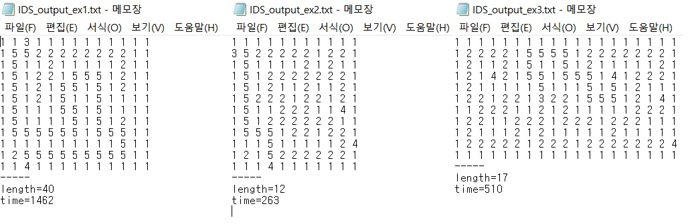
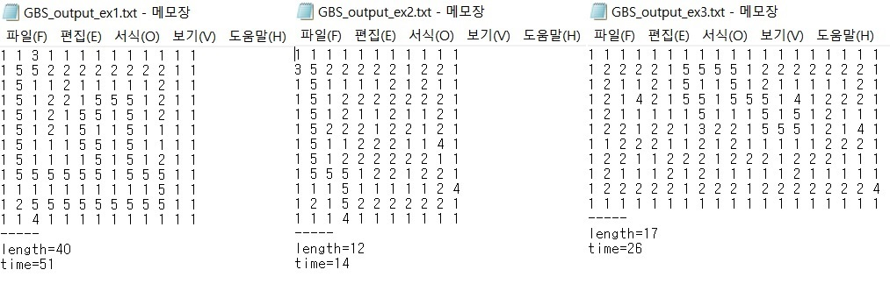
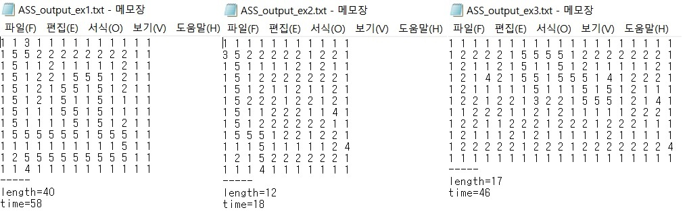

# 변형 미로 경로 탐색

### 2018-1학기 인공지능 과제 #1


## 과제 목표

- 다양한 Search Algorithm을 이용한 변형 미로 경로 탐색 수행

- Input : 1,2,3,4 로 구성된 M*N matrix. (1: 벽, 2: 길, 3: 출발점, 4 = 도착점). m, n <= 500

- Output : 1,2,3,4,5 로 구성된 M*N matrix (5: 최적 탐색 경로), 경로 길이( =5의 갯수), 탐색 횟수

- 하나의 입구, 다수의 출구 존재.

- 상,하,좌,우 4방향으로 이동 가능.

- 탐색 알고리즘

  - Iterative Deepening Search (IDS)
  - Greedy Best-first Search (GBS)
  - A* Search (ASS)

  ​

## Iterative Deepening Search(IDS)

Iterative Deepening Search 알고리즘의 특징은 다음과 같다.

> - Iterative Deepening Search(이하 IDS) 는 Depth 의 제한을 두고 Depth First Search(이하 DFS) 를 수행하며, Goal 을 찾을 때 까지 Depth를 증가시킨다.
> - DFS에서는 알 수 없었던 completeness를 보장하며 cost가 감소하지 않는 경우에 optimal 결과를 찾는 것 또한 보장한다. 
> - Breadth First Search(이하 BFS) 의 Space complexity = O(b^d) (b: branch factor, d = depth) 를 O(bd) 로 줄일 수 있다. 
> - Depth를 증가시켜 다시 search 할 때, 중복이 발생하나 큰 영향을 주지 못한다.


```c++
bool IDS(int row, int col, int cur, int depth, int** visited);
```

*IDS* 함수는 현재 위치 (*row*, *col*) 에서 *cur* 까지 탐색을 진행 했으며, 최대 *depth* 까지 탐색을 진행한다. *visited*는 뒤로 되돌아가지 않도록 마킹해주는 역할을 한다. 

```c++
// Increase IDS function call times
cnt++;
// Mark current position as visited
visited[row][col] = 1;
// Escape conditions
// 1. Found
if (map[row][col] == 4)
	return true;
// 2. Not Found
if (cur == depth) {
	visited[row][col] = 0;
	return false;
}        
```

 탐색 중 exit를 찾았을 경우(1) true를 return 하며, 끝까지 탐색하였으나 exit를 찾지 못하였을 경우(2)에는 현재 방문을 unmark하고 false를 return 한다. 현재 방문을 반드시 unmark 하여야 다른 탐색호출 (특히 cur 이 현재 탐색호출보다 낮을 경우엔 더 깊이 탐색이 가능하다) 에서 탐색이 가능하다.

```c++
// North
if (checkMove(row - 1, col, visited)) {
	if (IDS(row - 1, col, cur + 1, depth, visited)) {
		if (!(row == s_row && col == s_col))
			map[row][col] = 5;
		return true;
	}
}
// Do same on South, West, East...
// ...

visited[row][col] = 0;
return false;
}
```

 *checkMove* 함수를 통해 해당 위치로 이동할 수 있는지를 확인하고 이동이 가능하면 IDS 호출로 해당 위치를 탐색한다. 이 때, 현재 탐색 깊이를 +1 해준다. 만약, *IDS* 값이 true라면 출구를 찾았음을 의미하므로 현재 위치를 5로 바꾸어주고, true를 return 하여 이전 *IDS*탐색에서도 5로 값을 바꿀 수 있도록 한다.

 현재 위치에서 상,하,좌,우 모두 탐색하였음에도 경로를 찾지 못하였을 경우에는 false를 return 해준다.


## Greedy Best-first Search(GBS)

Greedy Best-first Search 알고리즘의 특징은 다음과 같다.

> - Best-first Search 는 evaluation function 을 통해 가장 goal에 가까운 node를 먼저 expand 한다.
> - Greedy Best-first Search(이하 GBS)는 evaluation function 으로 heuristic function을 사용하여 현재 node에서 goal로 가장 빠르게 갈 수 있는 node부터 expand한다.
> - DFS 처럼 탐색이 loop에 갇힐 수 있어 complete 하지 않으며, 결과 값이 optimal 하지 않을 수 있다.
> - Time complexity 와 Space complexity는 최악의 경우 모든 node들을 다 expand 해야 하므로 O(b^m)이 된다. (b: branch factor, m: max depth)


```c++
class Node {
    int row;
    int col;
    int heuristic;
    Node* parent;
};
```

  각각의 탐색 node를 나타내는  class를 다음과 같이 구성하였다. *row*, *col*은 해당 node의 좌표를, *heuristic*은 해당 node에서 heuristic 값을, *parent*는 해당 node의 부모를 각각 나타낸다.

```c++
void setHeuristic() { 
		int min_val = INFINITE;
		for (int i = 0; i < num_dest; i++) {
			min_val = min(min_val, abs(dest[i][0] - row) + abs(dest[i][1] - col));
		}
		heuristic = min_val;
	}
```

  Node의 heuritstic value를 구하는 method이다. 현재 node의 *row*와 *col*에서 모든 출구에 까지의 manhattan distance를 구하고, 이 중 최솟값을 heuristic value로 설정하였다.

```c++
priority_queue<Node*, vector<Node*>, Comparator> min_heap;
```

 탐색할 node들을 *min_heap*에 heuristic 기준으로 enqueue한다. 탐색 시 *min_heap* 에서 가장 heuristic 값이 가장 낮은 node를 dequeue 하고, 이 node를 탐색하게 된다.

```c++
// expand node
if (checkMove(cur->getRow() - 1, cur->getCol(), visited)) {
	Node* up = (Node*)malloc(sizeof(Node));
	up->initNode(cur->getRow() - 1, cur->getCol());
	up->setParent(cur);
	min_heap.push(up);
}
```

 현재 node에 대해서 다음으로 탐색할 node를 *checkMove* 함수로 찾는다. *checkMove*로 해당 위치로 이동할 수 있다면, 그 위치에 대한 node를 생성하고 *min_heap* 에 push 한다.

 IDS와는 달리 GBS에서는 탐색 실패시 해당 위치의 *visited* 여부를 초기화 시키지 않는다. 이는 heuristic value의 best에서 이미 탐색을 마쳤기 때문에, 더 나쁜 case에서는 탐색을 할 필요가 없기 때문이다.


## A* Search(ASS)

A* Search의 알고리즘의 특징은 다음과 같다. 

> - A* Search(이하 ASS) 는 Greedy Best-first Search(이하 GBS) 와 달리 현재 node에서 최적의 heuristic 값 + 현재 node까지 오는 비용을 evaluation function 으로 사용한다.
> - Heuristic function이 admissible 하다는 것은 모든 노드 n에 대해서 H(n)이 실제 goal로 가는 cost보다 같거나 작음을 말한다.
> - Heuristic function이 admissible하면, ASS는 optimal하다.


```c++
class Node {
	int row;
	int col;
	int passed_len;
	int heuristic;
	Node* parent;
}
```

 GBS와 node의 구조에서 현재 node까지의 탐색하는데 든 비용을 기록해두는 *passed_len* 멤버를 추가하였다.

```c++
int getCost() const { return heuristic + passed_len; }
```

 *getCost* 메소드를 추가하여 evaluation 값을 heuristic 값 + 현재 node까지의 cost 로 가져올 수 있도록 하였다. 이 evaluation 을 기준으로 *min_heap*을 구성하였다.


## 실험 결과

### IDS 



 미로 경로를 탐색하는데 있어서 많은 횟수의 탐색이 일어남을 볼 수 있다.


### GBS



 매 순간 heuristic value가 최적인 것을 골라서 탐색하기 때문에, 탐색 횟수가 매우 적다. 주어진 test case에서는 3경우 모두 optimal하나, 다른 case 에서는 optimal을 보장하지 못하였다. 


### ASS



 heuristic value + 현재 까지의 cost의 값 중 최적인 것을 골라서 탐색한다. GBS보다는 search 횟수가 늘어나지만, 항상 optimal한 결과를 보장한다.

